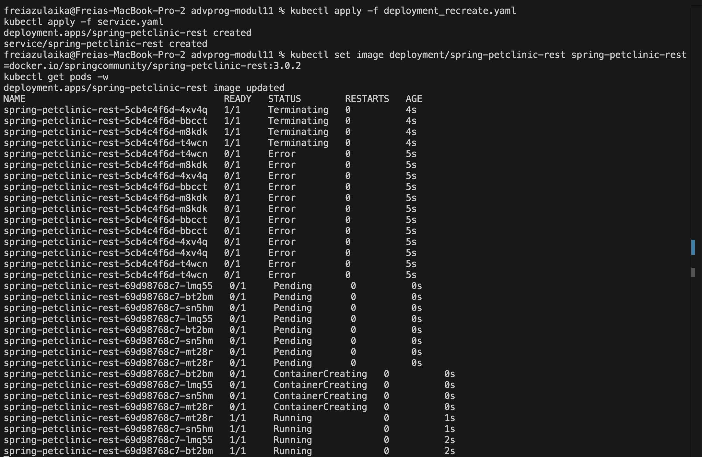

# Advanced Programming - Module 11

## Hello Minikube
> Compare the application logs before and after you exposed it as a Service. Try to open the app several times while the proxy into the Service is running. What do you see in the logs? Does the number of logs increase each time you open the app?

Foto di bawah ini merupakan kondisi logs sebelum saya mengexpose aplikasi sebagai suatu service.

Foto di bawah ini merupakan kondisi logs setelah saya mengexpose aplikasi sebagai service. Terdapat 2 baris logs baru, yaitu logs GET/ yang menandakan saya berhasil mengunjungi aplikasi tersebut dengan GET request.

Foto di bawah ini merupakan log setelah saya mengakses aplikasinya kembali. Dapat dilihat bahwa logs bertambah lagi sebanyak 2 baris yang isinya sama seperti logs sebelumnya dan hanya berbeda di bagian waktu akses.

> Notice that there are two versions of kubectl get invocation during this tutorial section. The first does not have any option, while the latter has -n option with value set to kube-system. What is the purpose of the -n option and why did the output not list the pods/services that you explicitly created?

Opsi `-n` pada perintah `kubectl get` digunakan untuk menentukan namespace tempat Kubernetes mencari resource seperti pod atau service. Secara default, Kubernetes akan mencari resource di namespace default. Sementara itu, jika kita menuliskan `-n kube-system`, maka yang ditampilkan hanyalah resource yang berada di namespace `kube-system` yaitu namespace khusus yang digunakan oleh komponen internal Kubernetes.

## Rolling Update & Kubernetes Manifest File

> What is the difference between Rolling Update and Recreate deployment strategy?

Perbedaan utama antara strategi deployment `Rolling Update` dan `Recreate` terletak pada downtime yang terjadi saat proses update berlangsung. Dengan menggunakan metode Rolling Update, aplikasi dapat diperbarui secara bertahap tanpa perlu adanya downtime. Pod lama akan digantikan satu per satu oleh pod baru sehingga aplikasi tetap berjalan dan pengguna tetap bisa mengaksesnya selama proses update berlangsung. Sedangkan, strategi Recreate akan mematikan semua pod lama terlebih dahulu sebelum pod baru dijalankan. Hal ini menyebabkan aplikasi mengalami downtime, yang durasinya bisa cukup lama tergantung pada perubahan yang dilakukan. Rolling Update lebih cocok untuk aplikasi yang membutuhkan ketersediaan tinggi dan Recreate bisa digunakan jika downtime tidak menjadi masalah.

> Try deploying the Spring Petclinic REST using Recreate deployment strategy and document
your attempt.
    

> Prepare different manifest files for executing Recreate deployment strategy.

Saya membuat manifest dengan nama 'deployment_recreate.yaml' menggunakan perintah seperti yang ada di modul. Pada bagian strategy, saya mengubah nilainya menjadi seperti ini:

`strategy:
    type: Recreate`

> What do you think are the benefits of using Kubernetes manifest files? Recall your experience
in deploying the app manually and compare it to your experience when deploying the same app by applying the manifest files (i.e., invoking `kubectl apply -f` command) to the cluster

Menurut saya, menggunakan manifest files jauh lebih efisien dibandingkan deployment manual karena konfigurasi deployment sudah tertulis rapi dalam satu file sehingga proses deploy bisa dilakukan otomatis dan konsisten. Hal ini juga dapat mengurangi kemungkinan kesalahan. Berbeda dengan deployment manual yang harus mengatur setting satu per satu dan rawan inkonsistensi, manifest files memungkinkan pengaturan yang langsung tepat sejak awal.